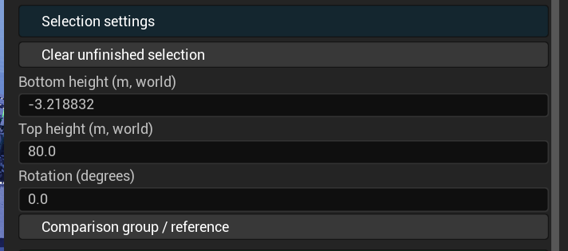
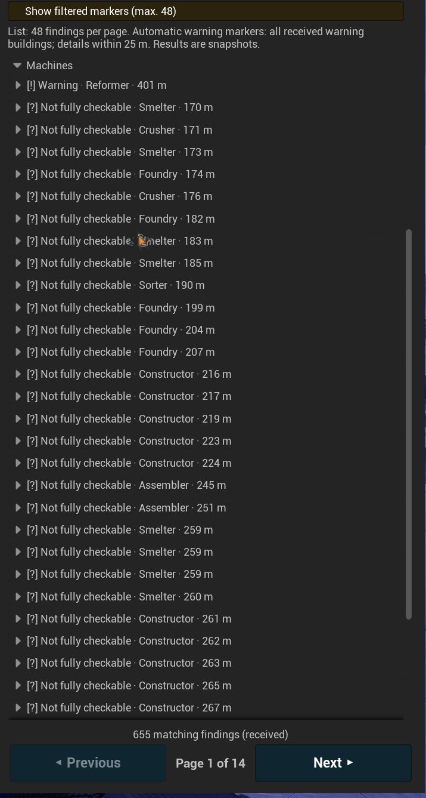
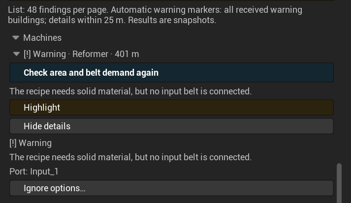
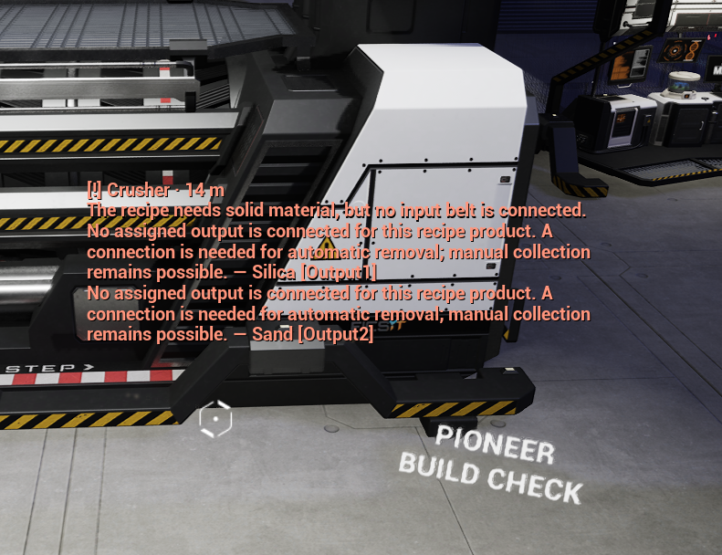
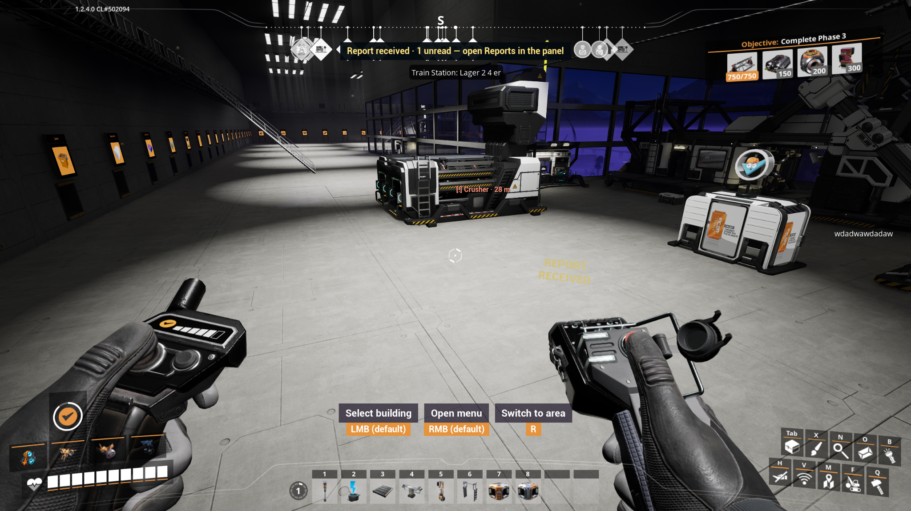
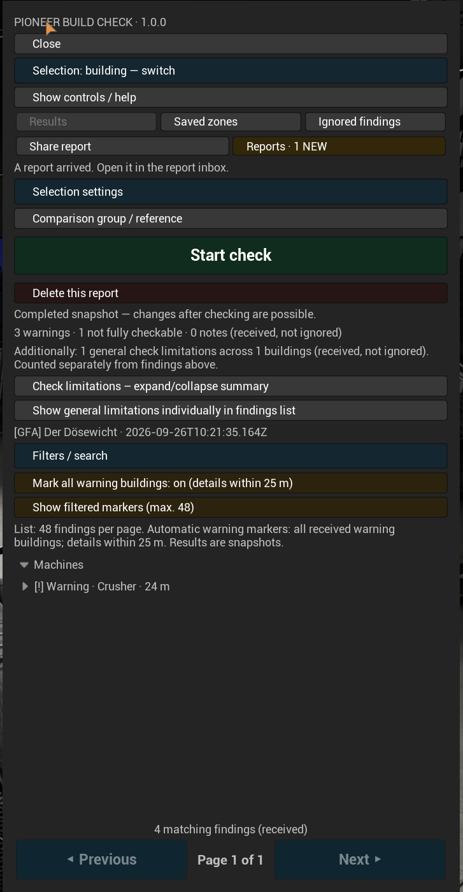
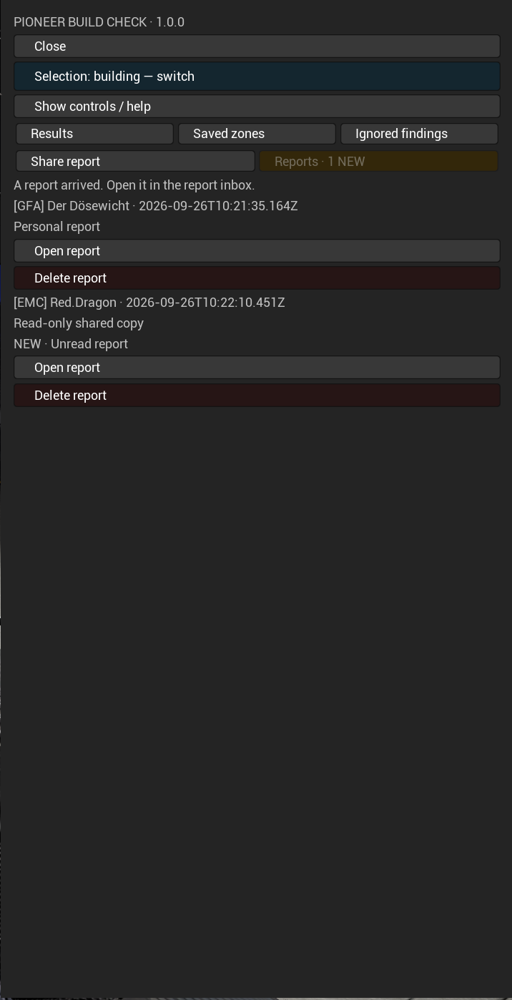
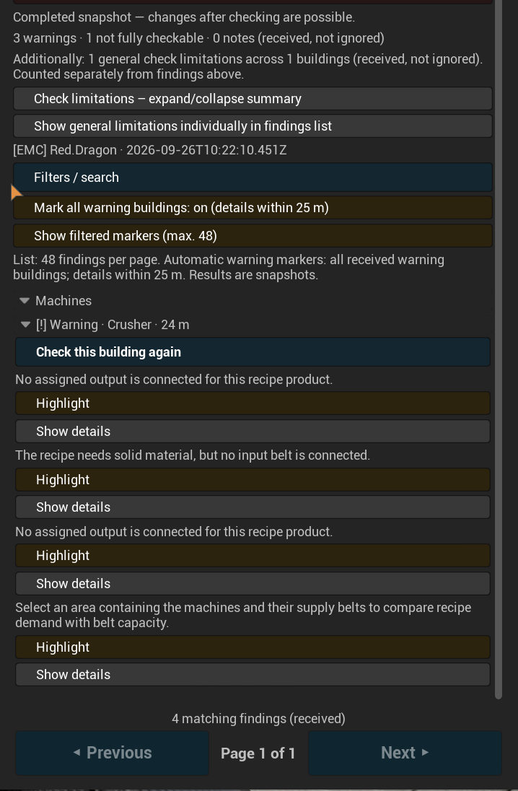

# Pioneer Build Check

Find missing settings and connection issues directly in your factory. Use the Build Check Gun to inspect individual buildings or a selected area, show warnings at machines and share reports with other players.

## Features

- Individual building checks and area selection with adjustable bottom height, top height and rotation.
- Checks for missing recipes, power connections and supported conveyor and pipe connection issues.
- Compare observed materials with recipe ingredients and supported belt capacities with configured demand.
- Compare recipes, configured clock speed and Sloop amplification against a reference machine of the same type.
- Highlight warning buildings and display detailed messages within 25 metres.
- Bounded upstream supply tracing with highlightable sources and stopping points.
- Filters, ignored findings, saved zones and reports.
- Multiplayer report sharing with visible notifications and unread status.
- German and English UI; single-player, self-hosted multiplayer and dedicated servers.

## Getting started

1. Install the mod through Satisfactory Mod Manager. In multiplayer, the server and all participating clients need the same mod version.
2. Unlock the **Pioneer Build Check** milestone in HUB Tier 1.
3. Craft the Build Check Gun in the Equipment Workshop and equip it.
4. Select a building or switch to area selection.
5. Open the panel and select **Start check**.

### Default controls

| Key | Action |
| --- | --- |
| Left mouse button | Select a building or place an area corner |
| Right mouse button | Open/close the Build Check panel |
| R | Switch between individual building and area selection |
| Esc | Close the Build Check panel |

The on-screen prompts and panel help describe the controls. Custom key bindings take precedence.

## Inspecting an area

Press **R** to enter area mode and place two corners with the left mouse button. Use **Selection settings** to adjust the bottom height, top height and rotation. Heights are world coordinates in metres. Include machines and their supply belts for belt-demand comparisons, then start the check.

## Reading results

Expand a building category and a finding. **Show details** opens its full explanation. Use **Highlight** to locate the building and run another check after making changes.

The list displays up to **48 findings per page**, with page navigation fixed at the bottom. This is not a limit of 48 scanned buildings. Automatic warning markers cover all received, non-ignored warning buildings; filtered markers are limited to 48.

| Result | Meaning |
| --- | --- |
| Warning | The check identified a specific condition that needs attention. Read the explanation and consider whether it is intentional. |
| Not fully checkable | Available data does not support a definitive assessment. This is not a confirmed construction error. |
| Note | Additional information about the configuration or observed material. |
| General check limitation | A building function is only partly covered; these limitations are summarized separately. |

## Messages at machines

Enable automatic warning building markers. Detailed messages appear within 25 metres, with compact labels at greater distances. World text hides while menus are open.

## Sources and stopping points

Supply diagnostics trace supported upstream connections within fixed limits. Select **Highlight source / stopping point** to locate the recorded endpoint and open its details to inspect connection data. If automatic tracing stops there, inspect that building or the next area separately to continue manually.

## Reference comparison and saved zones

Select an individual production machine as your reference, switch to area selection, include the reference and enable group comparison. Machines of the exact same type are compared with that reference. Zones can be saved with their group and reference. Set the reference again after dismantling or replacing its machine.

## Sharing and receiving reports

Open **Share report** and choose a recipient. Received reports are read-only copies. New reports are announced on the HUD, on the gun and in the report inbox.

Open the inbox, then open the unread report. Its unread status clears after reading. Any other unread reports remain marked.

## Check limitations and compatibility

Results are **snapshots**, not continuous monitoring. Run another check after changing buildings or settings. An identified configured source does not confirm actual material throughput. This mod is not a full power-grid or fluid simulation.

Unknown mod behavior, ambiguous material assignments and reached check limits may produce “Not fully checkable” findings. Screenshots include modded machines; this does not imply full support for every feature of those mods. A disconnected automatic output may be intentional when collecting products manually.

The notification sound was not audible in the reported multiplayer test. Visual notifications work independently.
